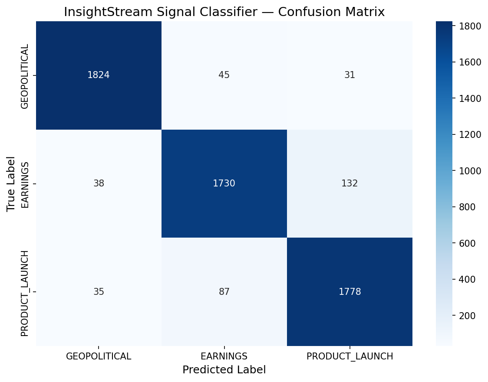

# InsightStream — Competitive Intelligence Engine

A production-grade, multi-agent AI system that continuously ingests competitive market data from YouTube, news articles, and SEC financial filings — classifies strategic business signals using a fine-tuned DistilBERT model — and generates automated intelligence reports via a LangGraph reasoning loop.

---

## Architecture

```
┌─────────────────────────────────────────────────────────────┐
│                        Frontend (Next.js)                    │
│         Signal Timeline │ Report Feed │ Chat Panel           │
└──────────────────────────────┬──────────────────────────────┘
                               │ HTTP + API Key Auth
┌──────────────────────────────▼──────────────────────────────┐
│                      FastAPI Backend                         │
│   /query   /ingest   /ingest/news   /ingest/sec   /reports   │
│                   Rate Limited + Auth                        │
└──────────────────────────────┬──────────────────────────────┘
                               │
         ┌─────────────────────▼──────────────────────┐
         │           Redis Cache (24hr TTL)            │
         │         Cache hit → instant return          │
         └─────────────────────┬──────────────────────┘
                               │ Cache miss
┌──────────────────────────────▼──────────────────────────────┐
│                   LangGraph Agent Pipeline                   │
│                                                              │
│  [Query Planner] → [Search Agent] → should_fallback()?       │
│                          │               │                   │
│                    ≥3 results        <3 results              │
│                          │               │                   │
│                          │      [Fallback Search Agent]      │
│                          │        ingest fresh news          │
│                          │               │                   │
│                    [Analyst Agent] ←──────┘                  │
│                    DistilBERT ML                             │
│                    EARNINGS / PRODUCT_LAUNCH / GEOPOLITICAL  │
│                          │                                   │
│                    [Writer Agent]                            │
│                    GPT-4o-mini structured report             │
└──────────┬───────────────┴──────────────────────────────────┘
           │                        │
┌──────────▼──────────┐  ┌──────────▼──────────┐
│  Pinecone Vector DB  │  │  PostgreSQL Reports  │
│  Chunks + Metadata  │  │  Signal + Timestamp  │
└─────────────────────┘  └─────────────────────┘

Nightly Scheduler (APScheduler 2AM):
→ Dynamic query generation per company
→ News + SEC ingestion
→ Auto report generation → PostgreSQL
```

---

## Tech Stack

| Layer | Technology | Purpose |
|---|---|---|
| Agent Orchestration | LangGraph | Multi-agent reasoning with conditional routing |
| LLM | GPT-4o-mini | Report generation |
| ML Classifier | DistilBERT (fine-tuned) | Signal classification |
| HP Search | Optuna | Hyperparameter optimization |
| Vector Store | Pinecone | Semantic search over ingested chunks |
| Relational DB | PostgreSQL + SQLAlchemy | Report persistence |
| Cache | Redis | 24hr query result caching |
| Backend | FastAPI | REST API with auth + rate limiting |
| Frontend | Next.js + Tailwind | Dashboard UI |
| Scheduler | APScheduler | Nightly automated pipeline |
| Ingestion | YouTube + Tavily + SEC EDGAR | Multi-source data |
| Eval | RAGAS + pytest | RAG quality + unit testing |
| Tracing | LangSmith | Agent pipeline observability |

---

## Key Engineering Decisions

**1. LangGraph over a simple LangChain chain**
The pipeline uses conditional routing — if Pinecone returns fewer than 3 relevant chunks, the graph triggers a fallback node that automatically fetches fresh news, ingests it, and retries the search before proceeding. This decision-making capability cannot be expressed in a linear chain.

**2. DistilBERT over GPT classification**
Using GPT-4o-mini for signal classification on every query would cost ~$0.002 per request and add 800ms latency. Fine-tuned DistilBERT runs locally in ~50ms at zero marginal cost. The tradeoff is a fixed training cost and periodic retraining for drift.

**3. Three storage layers with distinct roles**
Pinecone stores raw knowledge (chunks). PostgreSQL stores processed intelligence (reports + signals + timestamps). Redis stores recent query results (24hr TTL). Each layer has a specific access pattern — this separation prevents the vector store from being queried for structured data it was not designed to serve.

**4. Nightly scheduler with dynamic query generation**
Static scheduled queries produce duplicate reports. The Query Planner Agent generates a contextually relevant query per company per night using the current date — ensuring each report reflects fresh intelligence.

**5. Chunking strategy: 512 tokens, 50 overlap, tiktoken**
Fixed character splits lose sentence context at boundaries. Tiktoken-based splitting ensures chunks align with the LLM context window. 50-token overlap preserves cross-boundary context without excessive duplication.

---

## ML Model

- **Base model:** distilbert-base-uncased
- **Dataset:** AG News (120,000 articles, Sports category excluded)
- **Labels:** GEOPOLITICAL (World), EARNINGS (Business), PRODUCT_LAUNCH (Sci/Tech)
- **Hyperparameter search:** Optuna — 3 trials over learning_rate, batch_size, weight_decay
- **Final training:** 4 epochs with best hyperparameters, load_best_model_at_end

**Evaluation Results (Test Set — 5,700 samples):**

| Class | Precision | Recall | F1 Score |
|---|---|---|---|
| GEOPOLITICAL | 0.9615 | 0.9600 | 0.9608 |
| EARNINGS | 0.9291 | 0.9105 | 0.9197 |
| PRODUCT_LAUNCH | 0.9160 | 0.9358 | 0.9258 |
| **Overall Accuracy** | | | **0.9354** |



**Known Limitation:**
EARNINGS and PRODUCT_LAUNCH share business vocabulary causing some cross-class
misclassification — both categories discuss companies and announcements.
This is documented in `ml_models/model_card.txt`.

---

## Eval Results

**RAG Pipeline Quality — RAGAS Evaluation (10 samples):**

| Metric | Score | Meaning |
|---|---|---|
| Faithfulness | 0.7750 | 77.5% of claims grounded in retrieved chunks |
| Answer Relevancy | 0.8792 | Answers well-aligned with queries |
| Context Precision | 0.9000 | Retrieved chunks highly relevant |
| Context Recall | 0.6957 | Coverage of important information |
| **Average** | **0.8125** | Overall RAG quality score |

**ML Classifier — Test Set (5,700 samples):**

| Class | F1 Score |
|---|---|
| GEOPOLITICAL | 0.9608 |
| PRODUCT_LAUNCH | 0.9258 |
| EARNINGS | 0.9197 |
| **Overall Accuracy** | **93.54%** |

**Manual Eval Pipeline:**
Scored across Baseline, Stage 3, Stage 4, Stage 5 — results in `eval/` folder.

---

## Project Structure

```
insightstream/
├── api/
│   ├── routes/
│   │   └── intelligence.py     # All endpoints
│   └── schemas.py              # Pydantic models
├── ai_orchestration/
│   ├── state.py                # AgentState TypedDict
│   ├── nodes.py                # All agent node functions
│   └── graph.py                # LangGraph compiled pipeline
├── core_backend/
│   ├── database.py             # SQLAlchemy setup
│   ├── models.py               # Report table
│   └── security.py             # API key auth
├── ingestion_pipeline/
│   ├── youtube_loader.py
│   ├── news_loader.py
│   └── sec_loader.py
├── ml_models/
│   ├── signal_classifier.py    # Inference wrapper
│   ├── train_colab.ipynb       # Training notebook
│   ├── model_card.txt          # Model performance
│   └── best_checkpoint/        # Trained model (gitignored)
├── services/
│   ├── rag_service.py          # Query orchestration
│   └── cache_service.py        # Redis helpers
├── eval/
│   ├── baseline_results.json
│   ├── run_eval.py
│   └── eval_results_*.json
├── frontend_app/               # Next.js dashboard
├── tests/                      # pytest test suite
├── main.py                     # FastAPI app + scheduler
├── requirements.txt
└── .env.example                # Safe env template
```

---

## Quick Start

```bash
# 1. Clone and setup
git clone https://github.com/Ahmed-2003-khan/insightstream
cd insightstream
python -m venv venv
source venv/bin/activate  # Windows: venv\Scripts\activate
pip install -r requirements.txt

# 2. Configure environment
cp .env.example .env
# Fill in your API keys in .env

# 3. Start services
# Make sure PostgreSQL and Redis are running

# 4. Start backend
uvicorn main:app --reload

# 5. Start frontend
cd frontend_app && npm install && npm run dev

# 6. Ingest data and query
curl -X POST http://localhost:8000/api/v1/intelligence/ingest/news \
  -H "X-API-Key: your-key" \
  -H "Content-Type: application/json" \
  -d '{"topic": "Microsoft AI products 2026"}'
```

---

## Environment Variables

```
OPENAI_API_KEY=
PINECONE_API_KEY=
PINECONE_INDEX_NAME=
API_SECRET_KEY=
TAVILY_API_KEY=
LANGCHAIN_API_KEY=
DATABASE_URL=
REDIS_URL=
```

---

## Author
Ahmed — [github.com/Ahmed-2003-khan](https://github.com/Ahmed-2003-khan)
